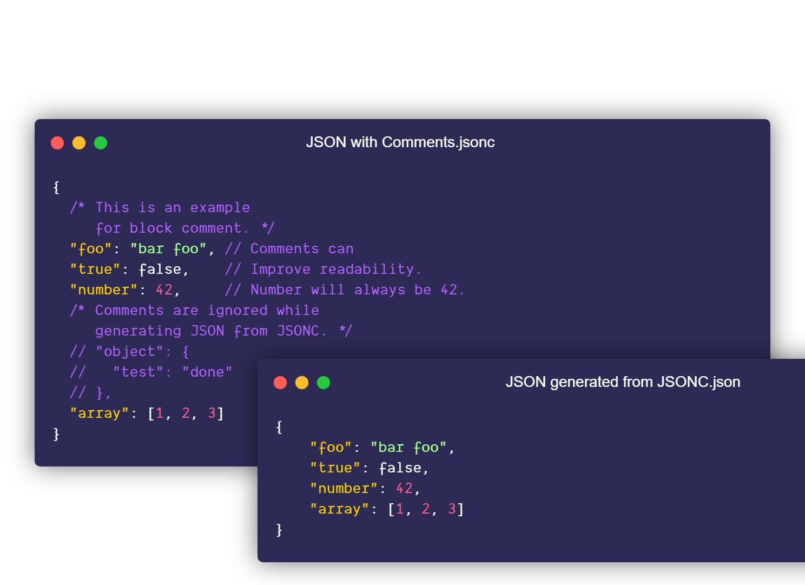

#


<p align="center">
  <i>JSON with comments for Go!</i> <br>
  <i><a href="https://travis-ci.com/muhammadmuzzammil1998/jsonc" target="_blank"></a></i>
</p>

JSONC is a superset of JSON which supports comments. JSON formatted files are readable to humans but the lack of comments decreases readability. With JSONC, you can use block (`/* */`) and single line (`//`) comments to describe the functionality. Microsoft VS Code also uses this format in their configuration files like `settings.json`, `keybindings.json`, `launch.json`, etc.



## What this package offers

**JSONC for Go** offers ability to convert and unmarshal JSONC to pure JSON. It also provides functionality to read JSONC file from disk and return JSONC and corresponding JSON encoding to operate on. However, it only provides a one way conversion. That is, you can not generate JSONC from JSON. Read [documentation](DOCUMENTATION.md) for detailed examples.

## Usage

### `go get` it

Run `go get` command to install the package.

```sh
$ go get muzzammil.xyz/jsonc
```

### Import jsonc

Import `muzzammil.xyz/jsonc` to your source file.

```go
package main

import (
  "fmt"

  "muzzammil.xyz/jsonc"
)
```

### Test it

Now test it!

```go
func main() {
  j := []byte(`{"foo": /*comment*/ "bar"}`)
  jc := jsonc.ToJSON(j) // Calling jsonc.ToJSON() to convert JSONC to JSON
  if jsonc.Valid(jc) {
    fmt.Println(string(jc))
  } else {
    fmt.Println("Invalid JSONC")
  }
}
```

```sh
$ go run app.go
{"foo":"bar"}
```

## Contributions

Contributions are welcome but kindly follow the Code of Conduct and guidelines. Please don't make Pull Requests for typographical errors, grammatical mistakes, "sane way" of doing it, etc. Open an issue for it. Thanks!
